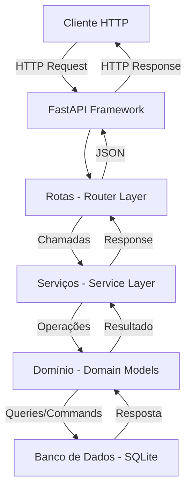
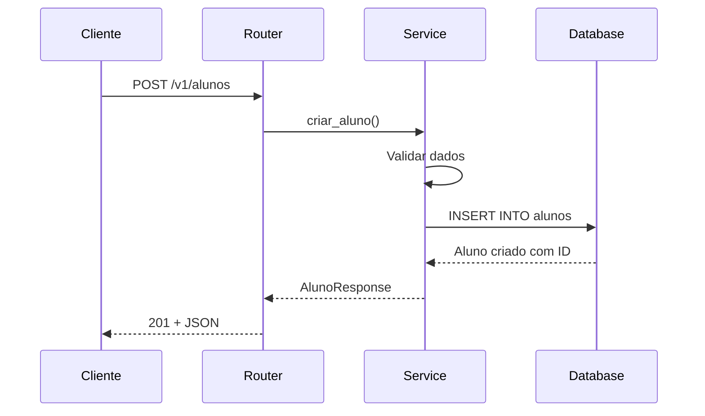
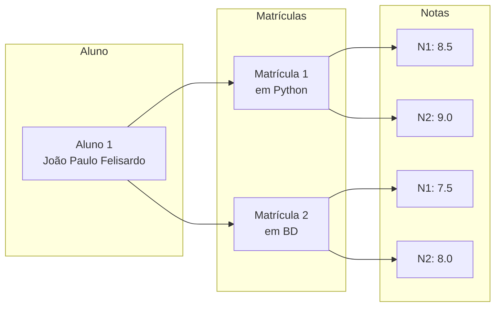
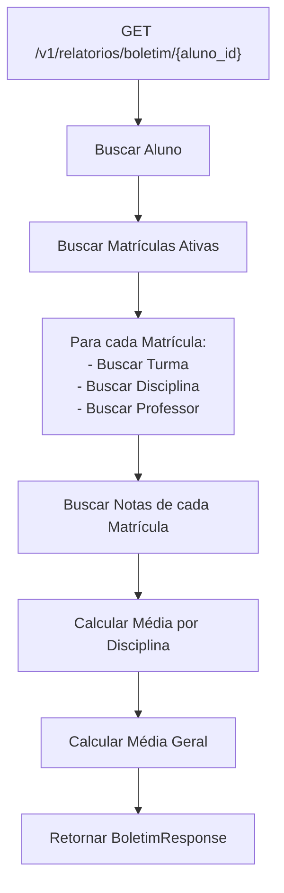
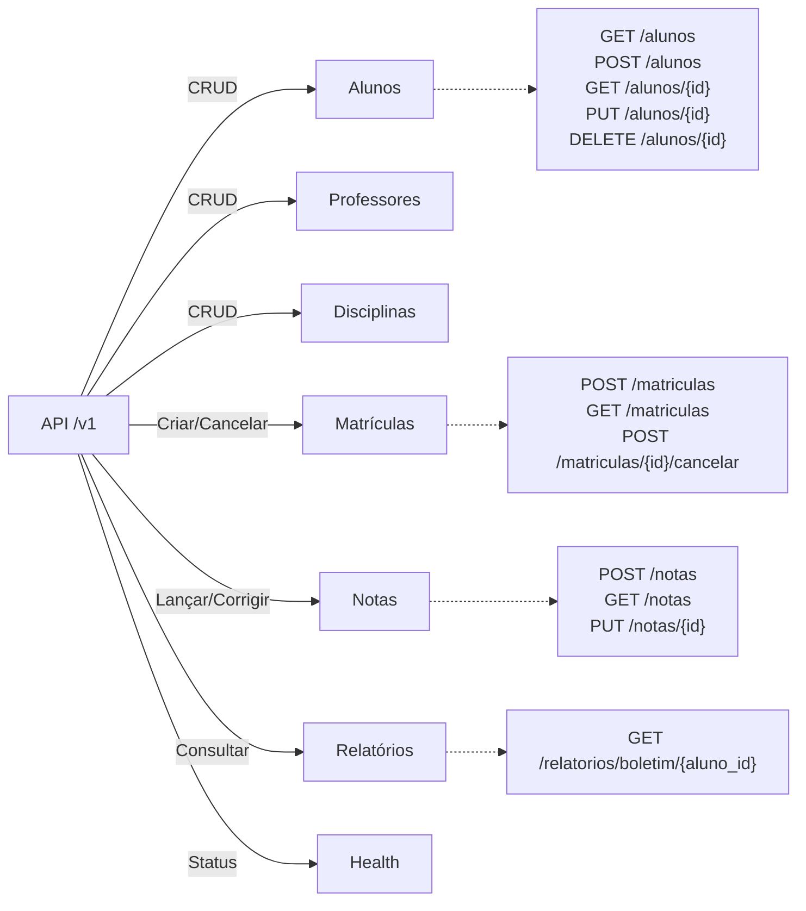
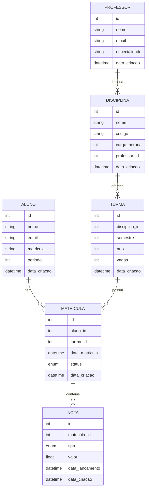
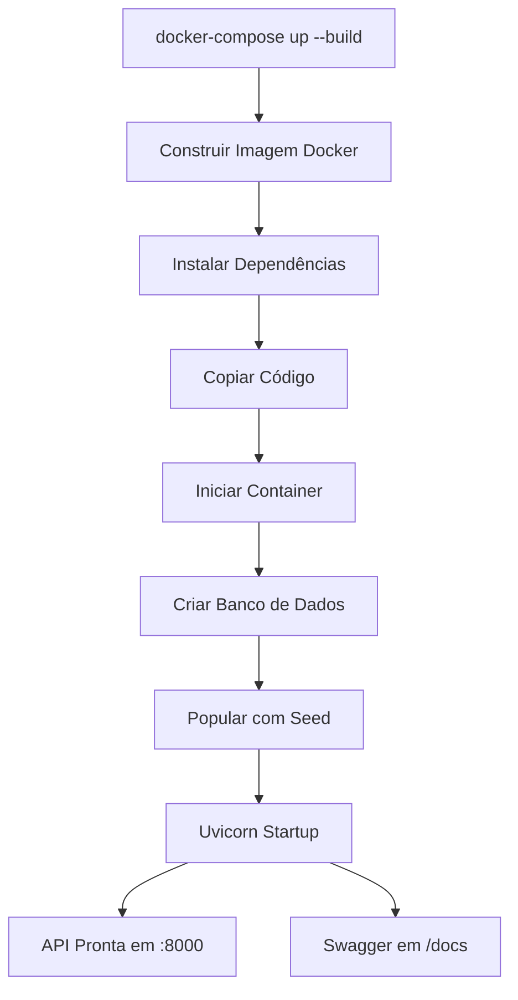

# Fluxograma da API Acadêmica

## Arquitetura em Camadas



## Fluxo de Criação de Aluno



## Fluxo de Matrícula e Consulta de Notas



## Fluxo de Relatório (Boletim)



## Estrutura de Diretórios

```
academico-api/
├── app/
│   ├── __init__.py
│   ├── main.py                      # FastAPI app + rotas globais
│   ├── domain/                      # Camada de Domínio
│   │   ├── __init__.py
│   │   └── models.py                # SQLAlchemy ORM Models
│   ├── schemas/                     # Camada de Esquemas
│   │   ├── __init__.py
│   │   └── schemas.py               # Pydantic schemas
│   ├── services/                    # Camada de Serviços (Business Logic)
│   │   ├── __init__.py
│   │   ├── aluno_service.py
│   │   ├── professor_service.py
│   │   ├── disciplina_service.py
│   │   ├── matricula_service.py
│   │   ├── nota_service.py
│   │   └── relatorio_service.py
│   ├── router/                      # Camada de Rotas (HTTP Endpoints)
│   │   ├── __init__.py
│   │   ├── aluno_router.py
│   │   ├── professor_router.py
│   │   ├── disciplina_router.py
│   │   ├── matricula_router.py
│   │   ├── nota_router.py
│   │   └── relatorio_router.py
│   └── database/                    # Camada de Banco de Dados
│       ├── __init__.py
│       ├── connection.py            # SQLAlchemy setup
│       └── seed.py                  # Seed com dados de exemplo
├── Dockerfile                       # Configuração do container
├── docker-compose.yml               # Orquestração de containers
├── requirements.txt                 # Dependências Python
├── pyproject.toml                   # Configuração do projeto
├── .gitignore
├── .dockerignore
├── README.md
└── FLUXOGRAMA.md
```

## Endpoints Principais



## Entidades e Relacionamentos



## Fluxo de Deploy com Docker


